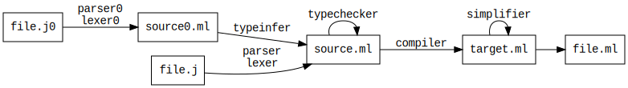

CompToCat
=========

Josselin GIET

Rendu du
[projet](https://gitlab.inria.fr/fpottier/mpri-2.4-public/blob/master/project/2018-2019/sujet.pdf)
 du cours de
[Programmation fonctionnelle et systèmes de
types](https://gitlab.inria.fr/fpottier/mpri-2.4-public) du
[MPRI](https://wikimpri.dptinfo.ens-cachan.fr/doku.php).


Compilation
-----------

Pour compiler le projet, il faut lancer la commande `make`, et pour lancer les
tests, il suffit de taper `make -C tests`.


### Options

*  `--typecheck`             Typecheck and stop.
*  `--typecheck-eta`         Typecheck, eta-expand and stop.
*  `--no-ok`                 Do not produce 'ok' witnesses.
*  `--no-simplify`           Do not apply the simplifier.
*  `--print-infer`           Print the steps in the type inference phase.
*  `--print-simplification`  Print the steps in the simplification phase.
*  `--compact`               Compacify the generated OCaml code.
*  `-help`,`--help`          Display this list of options


Travail effectué
----------------

Toutes les task demandées ont été implémentées.
Et tous les tests passent.

Les règles de simplification implémentées dans `simplifier.ml` sont les suivantes :
  - `id ∘ f` -> `f`
  - `f ∘ id` -> `f`
  - `apply ∘ (curry h Δ g)` -> `h ∘ (id Δ g)`

### Travail supplémentaire



J'ai implémenté un moteur d'inférence de type dans le fichier `typeinfer.ml`.
Afin de ne pas casser les autres tests (notamment ceux de la phase 2), j'ai mis
ce moteur avant la vérification de type.

Ainsi, `joujou` accepte un second format de fichier qui doit avoir l'extension
`.j0`. Dans ce second format les *binding* ne doivent pas forcément avoir le
type de l'identifiant déclaré.
Ces fichiers sont ensuite lus par `lexer0.mll` et `parser0.mly` et transformés
dans l'AST de `source0.ml`. C'est dans le fichier `IO.ml` que se trouve l'appel
au bon parser/lexer en fonction de l'extension.
Pour finir, cet AST est typé par `typeinfer.ml` et est transformée par un AST de
`source.ml`.

L'inférence de type est une version modifiée de l'algorithme W.
Cette implémentation se base sur le
[TP](https://www.lri.fr/~filliatr/ens/compil/td/4/index.html) du cours de
Compilation de J-C Filliâtre. Cette implémentation ne manipule pas de
substitutions explicites, mais uilise des variables de types destructives.

```ocaml
type tvar =
  { id : int;
    mutable def : typ option }
```

Cette implémentation est beaucoup plus légère car modifier une fois le champ
`def` le modifie dans toutes occurrences de cette variable.

Toutefois comme le langage cible est simplement typé (sans polymorphisme), il y
a quelques modifications par rapport à l'algorithme W :
- les `let`-binding ne sont pas généralisés. les variable de types non inférées
  ne sont pas universellement quantifiées, mais peuvent être unifiées dans le
  reste de fonctions.
- si le type d'une variable de type ne peut pas être inférée, alors le moteur
  d'inférence de type échoue. Le moteur de type n'essaye pas de mettre un type
  par défaut.

Par ailleurs, j'ai rajouté dans le dossier `\tests\task-0` quelques tests
unitaires, ainsi qu'un script de test dans le `Makefile`. On notera que le
perceptron est implémenté dans le langages sans annotations de types.
